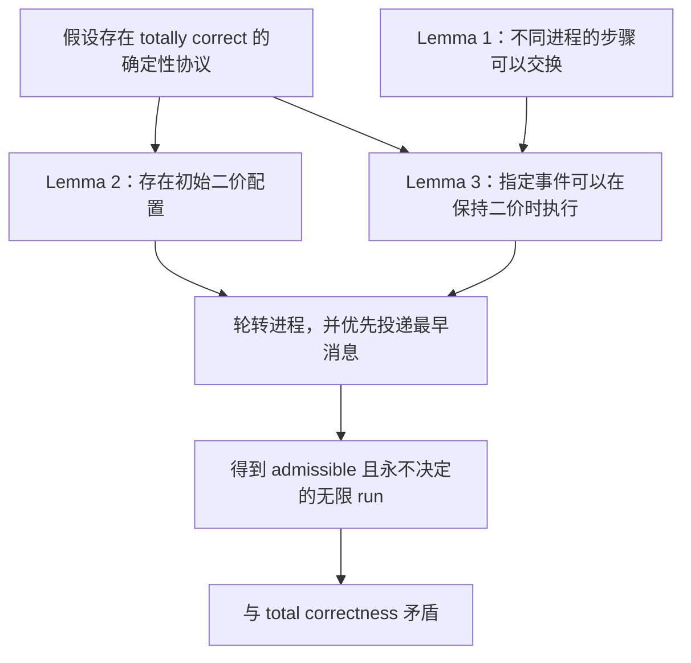
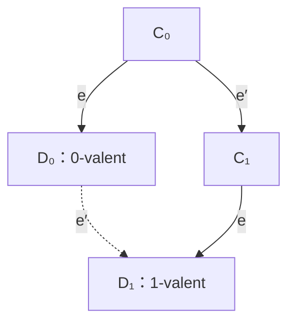
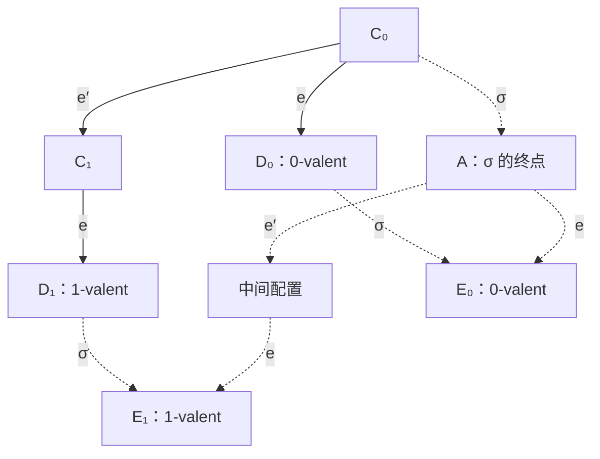

# FLP 不可能性结果：统一 Review

> 主文献：Fischer、Lynch、Paterson，JACM 32(2), 1985, pp. 374–382  
> 范围：完全异步消息传递、确定性二元共识、至多一个停止故障

## 摘要

FLP 的结论很窄，也很强：在完全异步、消息可靠但延迟无上界的系统中，只要允许一个进程停止，就不存在能在**每一条**合法执行上都保证作出决定的确定性共识协议。它没有说共识永远无法达成，也没有破坏 agreement。论文给出的反例，是一条符合模型要求、却始终没有进程决定的无限执行。

证明抓住的是配置的“二价性”。Lemma 2 找到一个初始二价配置；Lemma 3 说明，任意当前可执行事件都可以放到某段有限 schedule 的末尾，并在执行后继续保持二价；最后再用进程轮转和最早消息规则，把有限段接成一条公平、消息最终投递、但永不决定的无限执行。这里不能靠丢消息，也不能靠永久饿死某个进程。

## 1. 问题与结论

二元共识要求多个进程从各自的 0/1 输入出发，最终决定同一个值。论文使用两个安全性条件和一个活性条件刻画目标：

- **Agreement**：所有已经决定的进程决定相同的值。
- **Nontriviality**：0 和 1 都能在某些可达配置中成为决定值，排除永远固定输出同一个值的“协议”。这比现代教材常用的 strong validity 更弱。
- **Termination**：每条 admissible run 中最终至少有一个进程决定。结合 agreement，其他继续运行的进程不能决定另一个值。

论文把 agreement 与 nontriviality 合称 partial correctness，再把 partial correctness 与上述 termination 合称“在一个故障下 totally correct”。主定理是：

> 每一个在完全异步系统中满足 partial correctness 的确定性共识协议，都存在一条 admissible run，其中没有任何进程作出决定。因此，这样的协议不可能在一个故障下 totally correct。

这里最容易误读的是量词。结论是“对每个候选协议，都**存在**一条不终止的合法执行”，不是“协议的**每条**执行都失败”。写成符号就是：

```text
对任意确定性协议 P，都存在一条 admissible run R，使 R 永不决定。
```

协议是确定的，并不意味着 run 唯一。给定配置和 event，后继配置唯一；但调度器仍可选择下一步让哪个进程运行、向它交付哪条消息。FLP 利用的是事件次序的不确定性，不是进程内部的随机选择。

## 2. 模型：调度器可以慢，但不能作弊

系统至少包含两个确定性进程。每个进程有输入、本地状态、只写一次的输出以及无界存储；进程之间只通过消息通信。已发送而未接收的消息保存在全局消息缓冲区。

| 概念 | 在证明中的精确定义与作用 |
| --- | --- |
| event `(p, m)` | 进程 `p` 接收消息 `m` 并执行一个原子步骤；若当前没有选定消息，也可接收空值。给定配置与 event，后继配置唯一。 |
| configuration | 所有进程的内部状态，加上消息缓冲区中的全部在途消息。 |
| schedule / run | 可依次应用的 event 序列 / 这些 event 产生的实际执行步骤。 |
| faulty process | 在一条无限 run 中只执行有限多个步骤的进程。执行无限多个步骤的进程是 nonfaulty。 |
| admissible run | 至多一个进程 faulty，并且每条发给 nonfaulty 进程的消息最终都被接收。 |

“完全异步”表示进程速度和消息延迟没有已知上界，并不表示消息可以丢失。构造反例时，调度器必须同时满足两条约束：不能让两个或更多进程只执行有限步，也不能永远扣住发给持续运行进程的某条消息。

这一模型解释了停止故障为何难以识别：一个长期没有响应的进程，可能已经停止，也可能只是很慢，还可能是消息仍在路上。仅凭等待时长，其他进程无法区分这三种情况。

## 3. 二价性：把“尚未决定”变成可证明的不变量

对配置 `C`，令 `V(C)` 表示从 `C` 出发能够到达的决定值集合：

- `V(C) = {0}`：`C` 是 0-valent；
- `V(C) = {1}`：`C` 是 1-valent；
- `V(C) = {0, 1}`：`C` 是 bivalent。

单价性一旦出现就不会消失：若 `C` 是 0-valent，则它的任何后继也只能是 0-valent。反过来，只要一个可达配置已经包含某个决定值，agreement 就使它成为对应的单价配置。因此，维持二价不仅表示“当前还没决定”，还保证未来仍保留两种决定可能。

证明还反复使用一个交换性质（Lemma 1）：若两段 schedule 涉及互不相交的进程集合，它们可以交换执行顺序并到达同一配置。特别地，属于不同进程的两个当前可执行事件可以交换；属于同一进程的事件不能直接交换，因为第一步会改变第二步读取的本地状态。

交换性比较的是完整配置。不同进程的步骤各自修改本地状态；对消息缓冲区，它们只是删去各自接收的消息，再加入各自产生的有限消息集。两种执行次序完成的是同一组修改，所以终点相同。

整条证明的依赖关系如下：



## 4. Lemma 2：初始二价配置必然存在

先反设所有初始配置都是单价的。由 nontriviality，至少有某个能导向决定 0 的初始配置，也有某个能导向决定 1 的初始配置；在反设下，它们分别是 0-valent 和 1-valent。

把所有进程的输入逐个从前一个初始配置改成后一个，就得到一条初始配置链，相邻配置只差一个进程的输入。链的两端价不同，所以中间必有一对相邻配置 `C0`、`C1`，分别是 0-valent、1-valent，并且只在进程 `p` 的输入上不同。

现在从 `C0` 构造一条让 `p` 永远不执行、但对其他进程公平投递的 admissible run。`p` 是允许的唯一故障；若协议 totally correct，这条 run 的某个有限前缀必然已经让某个非 `p` 进程决定。把该有限 schedule 记为 `σ`。

`σ` 不含 `p` 的步骤，所以同样能从 `C1` 执行。除 `p` 外，所有进程在两次执行中看到相同状态、接收相同消息，因而作出相同决定。这个共同决定值无论是 0 还是 1，都会分别与 `C1` 的 1-valent 或 `C0` 的 0-valent 矛盾。故初始二价配置存在。

这一步本质上是不可区分性论证：当唯一不同输入所属的进程从未运行时，其他进程没有渠道得知那一位输入。

## 5. Lemma 3：任意事件都能安全地延后

给定二价配置 `C` 和一个当前可执行事件 `e`。记 `𝒞` 为从 `C` 出发、不执行 `e` 所能到达的配置集合，再令

```text
𝒟 = e(𝒞) = { e(E) | E ∈ 𝒞 }。
```

Lemma 3 断言：`𝒟` 中至少有一个二价配置。

若 `e` 接收具体消息，只要没有执行 `e`，该消息就仍在缓冲区中；若 `e` 是空接收，它按模型始终允许。因此 `e` 对 `𝒞` 中每个配置都可执行。

反设 `𝒟` 中的配置全都单价。因为 `C` 二价，可以分别找到从 `C` 可达的 0-valent 配置 `E0` 和 1-valent 配置 `E1`。若到达 `Ei` 的过程没有执行 `e`，那么 `e(Ei) ∈ 𝒟`，而单价配置的后继保持同价；若过程执行过 `e`，就取第一次执行 `e` 后的配置，它属于 `𝒟`，并能继续到达 `Ei`。在反设下该配置单价，所以也只能是 `i`-valent。由此，`𝒟` 中两种价都有。

`e(C)` 自己是其中一种价；在 `𝒞` 中选择一个配置 `E`，使 `e(E)` 具有相反的价。沿着一条从 `C` 到 `E`、不含 `e` 的有限 schedule 逐步比较，必然能找到第一次变价的位置。于是存在相邻配置 `C0`、`C1`，满足：

```text
C1 = e'(C0)，D0 = e(C0) 为 0-valent，D1 = e(C1) 为 1-valent。
```

接下来要看 `e` 与 `e'` 是否属于同一进程。

### 情形一：两个事件属于不同进程

由 Lemma 1，`e`、`e'` 可以交换。先执行 `e` 再执行 `e'`，与先执行 `e'` 再执行 `e`，到达的是同一配置：



图 1：不同进程的事件可交换。虚线边表示由交换性补出的路径。

这就要求 `D1` 同时是 0-valent 配置 `D0` 的后继和一个 1-valent 配置，不可能成立。

### 情形二：两个事件属于同一进程

若 `e`、`e'` 都属于进程 `p`，两步会先后修改 `p` 的本地状态，不能直接交换。此时从 `C0` 出发，让 `p` 暂停，公平安排其他进程。total correctness 保证最终有人决定；截取第一次决定以前的有限前缀，记为 `σ`，终点为 `A`。

`σ` 不含 `p` 的步骤，所以它能分别越过 `e` 和 `e'e`：



图 2：同进程情形不交换 `e`、`e'`，而是移动不含 `p` 的 schedule `σ`。

从 `A` 出发既能到达 0-valent 后继 `E0`，也能到达 1-valent 后继 `E1`，所以 `A` 二价；但 `A` 已经包含决定，按 agreement 又必须单价，矛盾。

两种情形都不成立，因此 `𝒟` 中必有二价配置。换句话说，总能找到一段有限 schedule，把指定事件 `e` 放在最后执行，并使末尾配置继续保持二价。Lemma 3 给出的不是完整无限执行，而是一轮可以反复使用的延伸。

## 6. 把有限轮次接成 admissible 的无限执行

从 Lemma 2 保证存在的初始二价配置开始，维护两个有序结构：

1. 一个进程优先队列，初始顺序任意；
2. 每个配置中的消息缓冲区，按消息发送时间从早到晚排序，同一时刻的次序任意固定。

每一轮从二价配置 `C` 开始：

1. 取进程队首 `p`。
2. 若轮次开始时有发给 `p` 的待收消息，取其中最早的 `m`；否则取空值。令目标事件为 `e = (p, m)`。
3. 调用 Lemma 3，找到一段以 `e` 收尾、且终点仍为二价的有限 schedule，把它作为本轮。
4. 把 `p` 移到进程队尾，开始下一轮。

一轮结束后回到同样的二价起点条件，因而可以无限重复：


图 3：无限 run 的一轮。每轮有限且非空，轮末重新得到二价配置。

这个构造同时维持三个不变量：

| 要求 | 为什么成立 |
| --- | --- |
| 无限推进 | 每轮至少包含末尾事件 `e`，所以每轮有限但非空，无限多个轮次形成无限 run。 |
| 进程公平 | 有限个进程轮转，每个进程都会反复到达队首，因而执行无限多个步骤。实际构造甚至没有 faulty process。 |
| 消息公平 | 一条消息发出前只可能有有限条更早的消息；每当接收者轮到队首，至少会消化轮次开始时最早的待收消息，所以目标消息经过有限多轮后必被接收。 |

消息公平可以再写得具体一些。取任意一条发给进程 `p` 的消息 `x`。`x` 发出时，排在它前面的旧消息只有有限条；此后每当 `p` 到达队首，只要 `x` 还未收到，这个数量就至少减少一。它不可能无限下降，所以经过有限轮后，`x` 会成为最早消息并被接收。

每轮终点都是二价。轮内也不可能曾进入单价配置，因为单价配置的所有后继仍是同价，无法在轮末重新变成二价。因此整条 run 的每个配置都保持二价，没有任何进程决定。

这条 run 中每个进程都执行无限多步，且每条发给这些进程的消息最终收到，所以它是 admissible；但它永不决定，与 total correctness 对每条 admissible run 的 termination 要求矛盾。主定理得证。

## 7. 结论的边界

FLP 精确排除的是“完全异步 + 确定性 + 至多一个停止故障 + 对所有 admissible runs 保证终止”的组合。阅读和应用这个结果时，应保留以下边界：

- 它不否认某些执行能够很快达成共识；它否认的是最坏情况下对所有合法执行的确定性终止保证。
- 它没有依靠消息丢失、两个进程崩溃或永久饿死正确进程；构造出的执行满足论文自己的 admissibility。
- 它不证明不同进程会决定不同值；候选协议仍可保持 agreement，失败发生在 termination。
- 它已经在弱于现代 validity/termination 定义的条件下成立，所以把正确性要求加强不会消除不可能性。
- 若要绕开结论，必须改变至少一个前提，例如增加时间信息、增加故障信息，或引入随机性；这些方向不属于本稿对原证明的展开范围。

读完整个证明后，真正需要记住的不是一句“异步共识不可能”，而是二价性怎样把调度的不确定性变成可维持的不变量。调度器每次只多争取一段有限的二价前缀；Lemma 3 让这件事可以重复，公平队列再保证重复过程没有作弊。无限的不决定执行，就是这样一段一段接出来的。

## 参考文献

Fischer, Michael J., Nancy A. Lynch, and Michael S. Paterson. “Impossibility of Distributed Consensus with One Faulty Process.” *Journal of the ACM* 32(2), 1985, 374–382.

图 1、图 2 根据原文 Figure 2、Figure 3 重绘；图 3 为本文对原文分阶段构造的整理。
